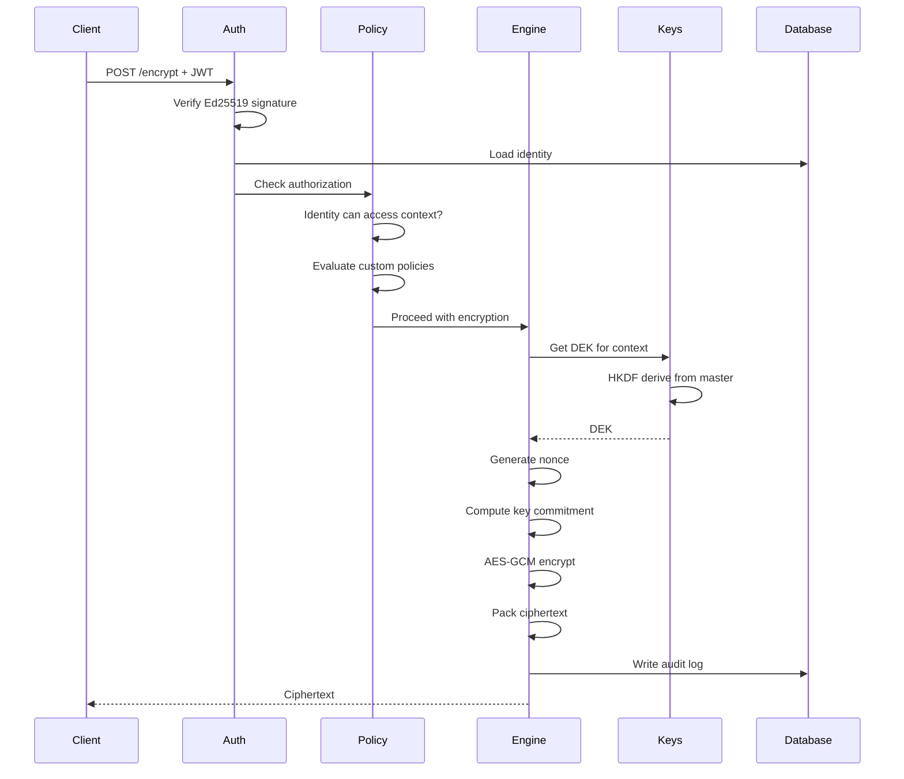
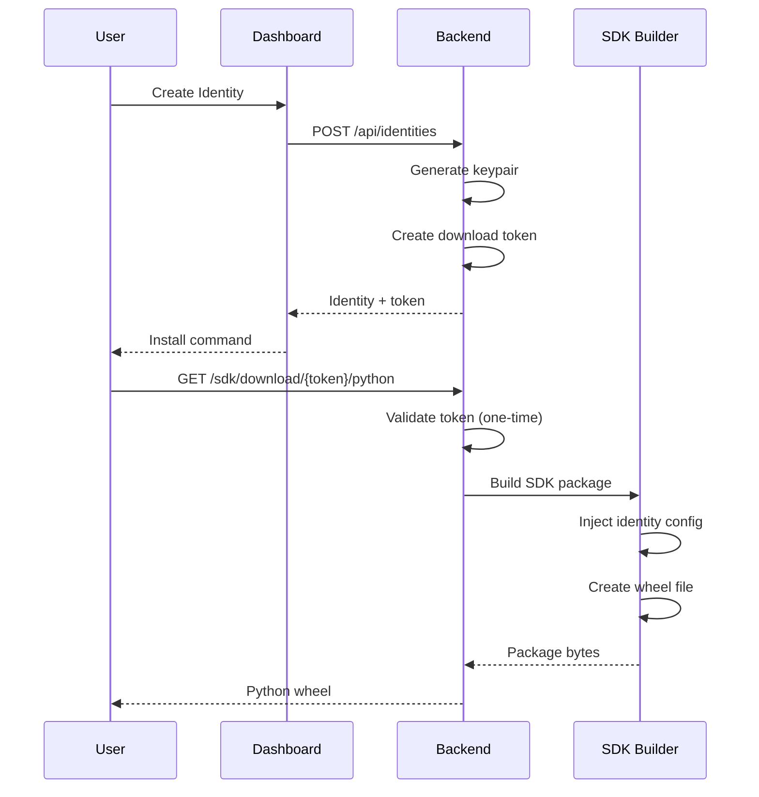

# Architecture

CryptoServe follows a service-oriented architecture with clear separation of concerns.

## System Overview

```
┌─────────────────────────────────────────────────────────────────────────────┐
│                            Client Applications                               │
│                                                                              │
│  ┌─────────────┐  ┌─────────────┐  ┌─────────────┐  ┌─────────────────────┐ │
│  │ Python SDK  │  │ TypeScript  │  │   Direct    │  │   Third-Party       │ │
│  │             │  │    SDK      │  │   REST      │  │   Integrations      │ │
│  └─────────────┘  └─────────────┘  └─────────────┘  └─────────────────────┘ │
└─────────────────────────────────────────────────────────────────────────────┘
                                       │
                                       │ HTTPS
                                       ▼
┌─────────────────────────────────────────────────────────────────────────────┐
│                              API Gateway                                     │
│                                                                              │
│  ┌──────────────────┐  ┌──────────────────┐  ┌────────────────────────────┐ │
│  │  Rate Limiting   │  │  TLS Termination │  │  Request Routing           │ │
│  └──────────────────┘  └──────────────────┘  └────────────────────────────┘ │
└─────────────────────────────────────────────────────────────────────────────┘
                                       │
                                       ▼
┌─────────────────────────────────────────────────────────────────────────────┐
│                              FastAPI Backend                                 │
│                                                                              │
│  ┌─────────────────────────────────────────────────────────────────────┐    │
│  │                      Authentication Layer                            │    │
│  │  ┌──────────────┐  ┌──────────────┐  ┌──────────────────────────┐   │    │
│  │  │ JWT Verify   │  │ OAuth Flow   │  │ Identity Resolution      │   │    │
│  │  │ (Ed25519)    │  │ (GitHub)     │  │                          │   │    │
│  │  └──────────────┘  └──────────────┘  └──────────────────────────┘   │    │
│  └─────────────────────────────────────────────────────────────────────┘    │
│                                                                              │
│  ┌─────────────────────────────────────────────────────────────────────┐    │
│  │                        Service Layer                                 │    │
│  │  ┌──────────────┐  ┌──────────────┐  ┌──────────────────────────┐   │    │
│  │  │  Identity    │  │   Context    │  │      Policy              │   │    │
│  │  │  Service     │  │   Service    │  │      Engine              │   │    │
│  │  └──────────────┘  └──────────────┘  └──────────────────────────┘   │    │
│  └─────────────────────────────────────────────────────────────────────┘    │
│                                                                              │
│  ┌─────────────────────────────────────────────────────────────────────┐    │
│  │                       Crypto Layer                                   │    │
│  │  ┌──────────────┐  ┌──────────────┐  ┌──────────────────────────┐   │    │
│  │  │ Crypto       │  │    Key       │  │     Hybrid PQC           │   │    │
│  │  │ Engine       │  │   Manager    │  │     (ML-KEM, ML-DSA)     │   │    │
│  │  └──────────────┘  └──────────────┘  └──────────────────────────┘   │    │
│  └─────────────────────────────────────────────────────────────────────┘    │
│                                                                              │
│  ┌─────────────────────────────────────────────────────────────────────┐    │
│  │                       Data Layer                                     │    │
│  │  ┌──────────────┐  ┌──────────────┐  ┌──────────────────────────┐   │    │
│  │  │ SQLAlchemy   │  │   Audit      │  │      Cache               │   │    │
│  │  │ (async)      │  │   Logger     │  │      (optional)          │   │    │
│  │  └──────────────┘  └──────────────┘  └──────────────────────────┘   │    │
│  └─────────────────────────────────────────────────────────────────────┘    │
└─────────────────────────────────────────────────────────────────────────────┘
                                       │
                                       ▼
┌─────────────────────────────────────────────────────────────────────────────┐
│                            Data Stores                                       │
│                                                                              │
│  ┌──────────────────┐  ┌──────────────────┐  ┌────────────────────────────┐ │
│  │   PostgreSQL     │  │   KMS (AWS/GCP)  │  │   Redis (optional)         │ │
│  │   (or SQLite)    │  │                  │  │                            │ │
│  └──────────────────┘  └──────────────────┘  └────────────────────────────┘ │
└─────────────────────────────────────────────────────────────────────────────┘
```

## Components

### API Gateway

The entry point for all requests. In production, typically nginx or a cloud load balancer.

**Responsibilities:**
- TLS termination
- Rate limiting
- Request routing
- Health checks

### Authentication Layer

Validates every request before processing.

```python
# app/auth/jwt.py
async def get_current_user(token: str) -> User:
    """Verify JWT and resolve user."""
    # 1. Decode JWT header to get key ID
    # 2. Fetch public key for the identity
    # 3. Verify Ed25519 signature
    # 4. Check expiration
    # 5. Return authenticated user
```

**Token Types:**

| Type | Algorithm | Lifetime | Purpose |
|------|-----------|----------|---------|
| Access Token | Ed25519 | 1 hour | API authentication |
| Refresh Token | HS256 | 30 days | Token renewal |

### Service Layer

Business logic for managing entities.

**Identity Service:**
- Create/revoke identities
- Generate personalized SDKs
- Manage context assignments

**Context Service:**
- CRUD for encryption contexts
- Algorithm resolution
- Policy attachment

**Policy Engine:**
- Evaluate policies at runtime
- Enforce cryptographic standards
- Generate warnings/blocks

### Crypto Layer

The core cryptographic implementation.

**Crypto Engine (`app/core/crypto_engine.py`):**

```python
class CipherFactory:
    """Factory for creating cipher instances."""

    @staticmethod
    def encrypt_gcm(key: bytes, plaintext: bytes, aad: bytes = None) -> bytes:
        """AES-GCM encryption with key commitment."""
        nonce = os.urandom(12)
        commitment = compute_key_commitment(key)
        cipher = AESGCM(key)
        ciphertext = cipher.encrypt(nonce, plaintext, aad)
        return pack_ciphertext(nonce, commitment, ciphertext)
```

**Key Manager (`app/core/key_manager.py`):**

```python
def derive_key(context: str, version: int = 1) -> bytes:
    """Derive a context-specific key using HKDF."""
    hkdf = HKDF(
        algorithm=hashes.SHA256(),
        length=32,
        salt=b"crypto-serve-v1",
        info=f"{context}:{version}".encode()
    )
    return hkdf.derive(master_key)
```

### Data Layer

Persistent storage using SQLAlchemy with async support.

**Models:**

| Model | Purpose |
|-------|---------|
| `User` | OAuth users (GitHub accounts) |
| `Tenant` | Multi-tenant isolation |
| `Identity` | API credentials |
| `Context` | Encryption policies |
| `Key` | Key metadata (not key material) |
| `AuditLog` | Operation history |
| `Policy` | Custom policy rules |

---

## Request Flow

### Encryption Request



### SDK Download



---

## Multi-Tenancy

CryptoServe supports multi-tenant deployments:

```
┌─────────────────────────────────────────────────────────────────┐
│                         CryptoServe                              │
│                                                                  │
│  ┌─────────────────┐  ┌─────────────────┐  ┌─────────────────┐  │
│  │   Tenant A      │  │   Tenant B      │  │   Tenant C      │  │
│  │                 │  │                 │  │                 │  │
│  │  ┌───────────┐  │  │  ┌───────────┐  │  │  ┌───────────┐  │  │
│  │  │ Users     │  │  │  │ Users     │  │  │  │ Users     │  │  │
│  │  ├───────────┤  │  │  ├───────────┤  │  │  ├───────────┤  │  │
│  │  │ Contexts  │  │  │  │ Contexts  │  │  │  │ Contexts  │  │  │
│  │  ├───────────┤  │  │  ├───────────┤  │  │  ├───────────┤  │  │
│  │  │ Identities│  │  │  │ Identities│  │  │  │ Identities│  │  │
│  │  ├───────────┤  │  │  ├───────────┤  │  │  ├───────────┤  │  │
│  │  │ Keys      │  │  │  │ Keys      │  │  │  │ Keys      │  │  │
│  │  └───────────┘  │  │  └───────────┘  │  │  └───────────┘  │  │
│  └─────────────────┘  └─────────────────┘  └─────────────────┘  │
└─────────────────────────────────────────────────────────────────┘
```

**Isolation guarantees:**

1. **Data isolation**: All queries include `tenant_id` filter
2. **Key isolation**: Keys derived with tenant ID in HKDF info
3. **Context isolation**: Context names are unique per tenant
4. **Audit isolation**: Logs filtered by tenant

---

## Technology Stack

| Layer | Technology |
|-------|------------|
| API Framework | FastAPI 0.100+ |
| ORM | SQLAlchemy 2.0 (async) |
| Database | PostgreSQL / SQLite |
| Crypto | cryptography (OpenSSL), liboqs |
| Auth | PyJWT, Ed25519 |
| Frontend | Next.js 14, shadcn/ui |
| SDK | Python 3.11+, TypeScript |
| Container | Docker, Docker Compose |
| Orchestration | Kubernetes (optional) |

---

## Scalability

### Horizontal Scaling

The API is stateless and can be horizontally scaled:

```yaml
services:
  backend:
    image: cryptoserve/backend
    deploy:
      replicas: 3
    environment:
      - DATABASE_URL=postgresql://...
```

### Performance Considerations

| Component | Bottleneck | Mitigation |
|-----------|------------|------------|
| Encryption | CPU-bound | AES-NI hardware acceleration |
| Key derivation | Per-request HKDF | Optional key caching |
| Database | Connection pool | pgbouncer, read replicas |
| JWT verification | Signature check | Cache public keys |

### Caching Strategy

```python
# Key caching (optional)
@lru_cache(maxsize=100)
def get_cached_key(context: str, version: int) -> bytes:
    return derive_key(context, version)
```

---

## Security Boundaries

```
┌─────────────────────────────────────────────────────────────────┐
│                         Trust Boundary                           │
│                                                                  │
│  ┌──────────────────────────────────────────────────────────┐   │
│  │                 CryptoServe Server                        │   │
│  │                                                           │   │
│  │  Master Key (in memory)                                   │   │
│  │  DEKs (derived per request)                               │   │
│  │  Private signing keys (encrypted at rest)                 │   │
│  │                                                           │   │
│  └──────────────────────────────────────────────────────────┘   │
│                                                                  │
└─────────────────────────────────────────────────────────────────┘
                              │
                              │ TLS
                              ▼
┌─────────────────────────────────────────────────────────────────┐
│                      Untrusted Network                           │
└─────────────────────────────────────────────────────────────────┘
                              │
                              ▼
┌─────────────────────────────────────────────────────────────────┐
│                       Client Application                         │
│                                                                  │
│  JWT access token (in memory)                                    │
│  No key material                                                 │
│                                                                  │
└─────────────────────────────────────────────────────────────────┘
```

**What clients NEVER see:**
- Master key
- Derived encryption keys
- Private signing keys
- Other tenants' data

**What clients CAN see:**
- Their own ciphertext
- Their JWT tokens
- Their audit logs
