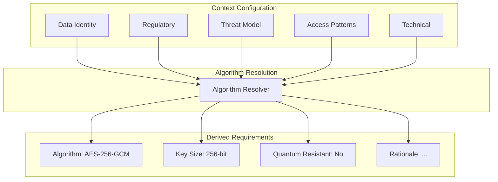

# 5-Layer Context Model

CryptoServe's context model automatically selects the optimal cryptographic algorithm based on five layers of configuration.

## Overview

Instead of choosing algorithms manually, you describe **what** you're protecting and **why**. CryptoServe figures out **how**.



## The Five Layers

### Layer 1: Data Identity

**What are you protecting?**

```python
data_identity = DataIdentity(
    sensitivity="critical",  # low, medium, high, critical
    classification="pii",    # public, internal, confidential, pii, phi, pci
    examples=["SSN", "credit card numbers", "medical records"]
)
```

| Sensitivity | Description | Minimum Algorithm |
|-------------|-------------|-------------------|
| `low` | Public or non-sensitive | AES-128-GCM |
| `medium` | Internal business data | AES-128-GCM |
| `high` | Confidential data | AES-256-GCM |
| `critical` | PII, PHI, PCI data | AES-256-GCM + audit |

### Layer 2: Regulatory

**What compliance requirements apply?**

```python
regulatory = Regulatory(
    frameworks=["hipaa", "pci-dss", "gdpr"],
    data_residency="us",
    audit_requirements="detailed"
)
```

| Framework | Requirements |
|-----------|--------------|
| HIPAA | AES-256, audit logging, access controls |
| PCI-DSS | Strong encryption, key management, audit |
| GDPR | Encryption at rest and in transit |
| SOC 2 | Encryption, access logging |
| FedRAMP | FIPS-validated algorithms |

### Layer 3: Threat Model

**Who are you protecting against?**

```python
threat_model = ThreatModel(
    adversary_capability="nation_state",  # script_kiddie, criminal, nation_state
    attack_vectors=["network", "insider", "quantum"],
    protection_duration_years=10,
    quantum_threat=True
)
```

| Adversary | Recommended Response |
|-----------|---------------------|
| `script_kiddie` | Standard encryption |
| `criminal` | Strong encryption, rate limiting |
| `nation_state` | Maximum security, PQC consideration |

**Quantum Threat Consideration:**

If `protection_duration_years` exceeds estimated quantum timeline (~10 years), hybrid PQC modes are recommended.

### Layer 4: Access Patterns

**How will the data be used?**

```python
access_patterns = AccessPatterns(
    read_frequency="high",      # low, medium, high
    write_frequency="low",
    batch_operations=False,
    latency_sensitive=True
)
```

| Pattern | Algorithm Choice |
|---------|-----------------|
| High frequency + low latency | AES-GCM (hardware accelerated) |
| Batch operations | Parallel-friendly modes |
| Infrequent access | Can use slower but stronger algorithms |

### Layer 5: Technical

**What are the infrastructure constraints?**

```python
technical = Technical(
    hardware_acceleration=True,  # AES-NI available
    fips_required=False,
    key_size_preference=256,
    mode_preference="gcm"
)
```

| Constraint | Impact |
|------------|--------|
| No AES-NI | Consider ChaCha20-Poly1305 |
| FIPS required | Block non-FIPS algorithms |
| Memory constrained | Streaming modes |

---

## Algorithm Resolution

The resolver evaluates all five layers to produce a recommendation:

```python title="app/core/algorithm_resolver.py"
def resolve_algorithm(config: ContextConfig) -> DerivedRequirements:
    """Resolve optimal algorithm from 5-layer config."""

    # Start with baseline
    algorithm = "AES-128-GCM"
    key_bits = 128
    rationale = []

    # Layer 1: Data sensitivity
    if config.data_identity.sensitivity in ("high", "critical"):
        algorithm = "AES-256-GCM"
        key_bits = 256
        rationale.append("High sensitivity requires 256-bit keys")

    # Layer 2: Regulatory
    if "hipaa" in config.regulatory.frameworks:
        algorithm = "AES-256-GCM"
        key_bits = 256
        rationale.append("HIPAA requires AES-256")

    # Layer 3: Threat model
    if config.threat_model.quantum_threat:
        algorithm = "AES-256-GCM+ML-KEM-768"
        rationale.append("Quantum threat requires hybrid PQC")

    # Layer 4: Access patterns
    if config.access_patterns.latency_sensitive:
        if "ML-KEM" in algorithm:
            rationale.append("Warning: PQC adds latency")

    # Layer 5: Technical
    if config.technical.fips_required:
        if "ChaCha" in algorithm:
            algorithm = "AES-256-GCM"
            rationale.append("ChaCha20 not FIPS-approved, using AES-GCM")

    return DerivedRequirements(
        resolved_algorithm=algorithm,
        key_bits=key_bits,
        quantum_resistant="ML-KEM" in algorithm,
        rationale=rationale
    )
```

---

## Creating a Context

### Via Dashboard

1. Navigate to **Contexts** → **Create New**
2. Fill in each layer:

!!! example "Context Creation Form"
    The form guides you through each of the 5 layers:

    - **Data Identity**: Category, sensitivity, PII/PHI/PCI flags
    - **Regulatory**: Compliance frameworks, retention policies
    - **Threat Model**: Adversaries, protection lifetime
    - **Access Patterns**: Frequency, latency requirements
    - **Algorithm**: Auto-resolved or manually selected

### Via API

```bash
curl -X POST http://localhost:8003/api/contexts \
  -H "Authorization: Bearer $TOKEN" \
  -H "Content-Type: application/json" \
  -d '{
    "name": "financial-records",
    "display_name": "Financial Records",
    "description": "Encrypted financial documents",
    "config": {
      "data_identity": {
        "sensitivity": "critical",
        "classification": "pci",
        "examples": ["bank statements", "tax returns"]
      },
      "regulatory": {
        "frameworks": ["pci-dss", "sox"],
        "audit_requirements": "detailed"
      },
      "threat_model": {
        "adversary_capability": "criminal",
        "protection_duration_years": 7
      },
      "access_patterns": {
        "read_frequency": "low",
        "write_frequency": "low"
      },
      "technical": {
        "fips_required": true
      }
    }
  }'
```

### Response

```json
{
  "name": "financial-records",
  "display_name": "Financial Records",
  "algorithm": "AES-256-GCM",
  "derived": {
    "resolved_algorithm": "AES-256-GCM",
    "key_bits": 256,
    "quantum_resistant": false,
    "rationale": [
      "Critical sensitivity requires 256-bit keys",
      "PCI-DSS compliance requires AES-256",
      "FIPS mode enabled"
    ]
  }
}
```

---

## Default Contexts

CryptoServe includes pre-configured contexts:

| Context | Sensitivity | Compliance | Algorithm |
|---------|-------------|------------|-----------|
| `user-pii` | Critical | GDPR, CCPA | AES-256-GCM |
| `payment-data` | Critical | PCI-DSS | AES-256-GCM |
| `health-data` | Critical | HIPAA | AES-256-GCM |
| `session-tokens` | Medium | - | AES-256-GCM |
| `general` | Medium | - | AES-256-GCM |

---

## Best Practices

### 1. Be Specific About Sensitivity

```python
# Bad: Vague classification
data_identity = DataIdentity(sensitivity="high")

# Good: Specific classification with examples
data_identity = DataIdentity(
    sensitivity="critical",
    classification="phi",
    examples=["patient diagnoses", "treatment plans", "lab results"]
)
```

### 2. Consider Future Threats

If data must remain confidential for 10+ years, enable quantum threat consideration:

```python
threat_model = ThreatModel(
    protection_duration_years=15,
    quantum_threat=True  # Enable hybrid PQC
)
```

### 3. Match Access Patterns

For high-frequency operations, avoid PQC overhead:

```python
# High-frequency context (sessions, caching)
access_patterns = AccessPatterns(
    read_frequency="high",
    latency_sensitive=True
)
# Resolver will prefer AES-GCM over hybrid modes

# Archive context (long-term storage)
access_patterns = AccessPatterns(
    read_frequency="low",
    latency_sensitive=False
)
# Resolver can use hybrid PQC
```

### 4. Use FIPS When Required

```python
technical = Technical(fips_required=True)
# Blocks: ChaCha20-Poly1305, Argon2
# Allows: AES-GCM, AES-CBC, ML-KEM, ML-DSA
```

---

## Algorithm Selection Matrix

| Sensitivity | Compliance | Quantum Threat | Algorithm |
|-------------|------------|----------------|-----------|
| Low | None | No | AES-128-GCM |
| Medium | None | No | AES-256-GCM |
| High | Any | No | AES-256-GCM |
| Critical | HIPAA/PCI | No | AES-256-GCM |
| Any | Any | Yes | AES-256-GCM + ML-KEM-768 |
| Any | FedRAMP | Any | AES-256-GCM (FIPS) |

---

## Overriding Algorithm Selection

While the 5-layer model handles most cases, you can set explicit algorithm policies:

```python
# Force specific algorithm (not recommended)
context.algorithm_policy = AlgorithmPolicy(
    allowed_algorithms=["AES-256-GCM"],
    blocked_algorithms=["AES-128-*", "ChaCha20-*"]
)
context.policy_enforcement = "enforce"  # or "warn"
```

See [Policy Engine](policy-engine.md) for details.
