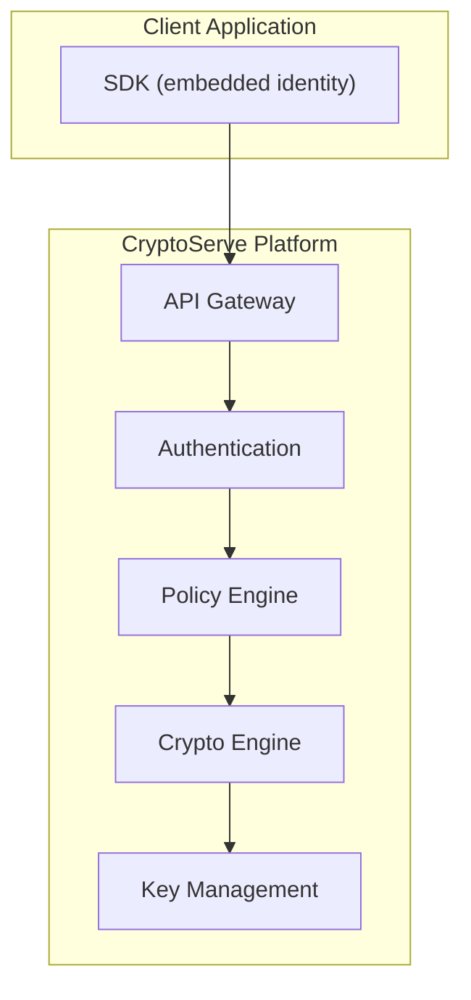
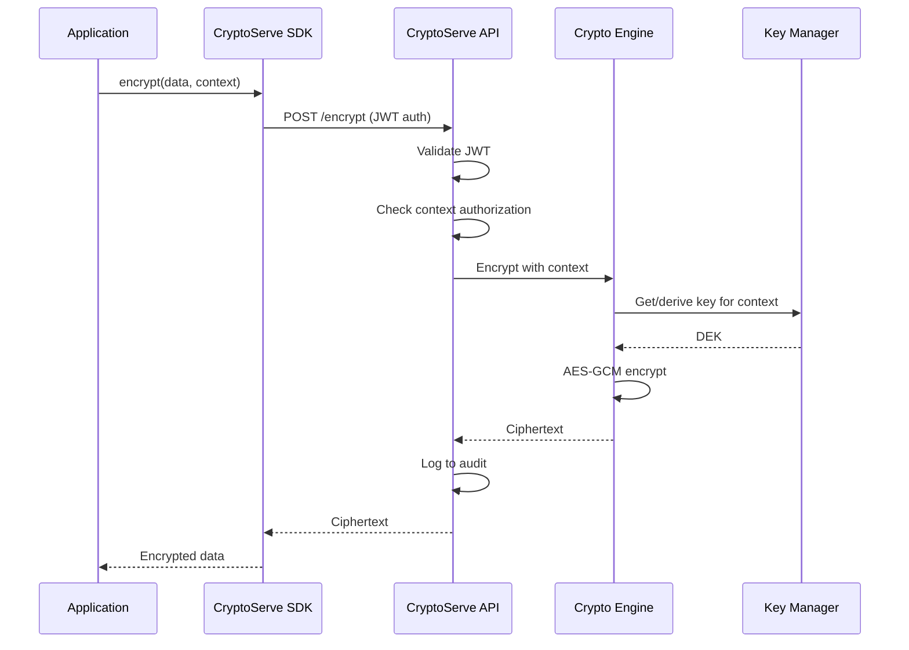

# Concepts

Understanding CryptoServe's architecture and design principles.

## Overview

CryptoServe is built on several key concepts that work together to provide secure, easy-to-use cryptography:

## Core Concepts

| Concept | Description | Link |
|---------|-------------|------|
| **Architecture** | System components, data flow, and design decisions | [Architecture](architecture.md) |
| **5-Layer Context Model** | How contexts determine the optimal encryption algorithm | [Context Model](context-model.md) |
| **Key Management** | Key derivation, rotation, and storage | [Key Management](key-management.md) |
| **Policy Engine** | Runtime enforcement of cryptographic standards | [Policy Engine](policy-engine.md) |
| **Post-Quantum Cryptography** | NIST-standardized algorithms and hybrid modes | [Post-Quantum](post-quantum.md) |

## Design Principles

### 1. Zero Configuration

Developers shouldn't need to understand cryptography to use it correctly. The SDK works immediately after import with all complexity hidden.

### 2. Defense in Depth

Multiple layers of security protect data:

- Transport encryption (TLS)
- Authentication (JWT with Ed25519)
- Authorization (context-based access control)
- Encryption (AES-GCM with key commitment)
- Audit logging (complete operation history)

### 3. Cryptographic Agility

The system can migrate between algorithms without breaking existing data:

- Self-describing ciphertext format
- Version headers enable parsing of old formats
- Key rotation without re-encryption
- Policy-driven algorithm selection

### 4. Fail Secure

When errors occur, the system defaults to denying access rather than potentially exposing data.

### 5. Auditability

Every cryptographic operation is logged with:

- Identity performing the operation
- Context and algorithm used
- Timestamp and duration
- Success/failure status

## Terminology

| Term | Definition |
|------|------------|
| **Identity** | A credential representing an application or service |
| **Context** | A named encryption policy (e.g., "user-pii", "payment-data") |
| **SDK** | The client library with embedded identity |
| **DEK** | Data Encryption Key — encrypts actual data |
| **KEK** | Key Encryption Key — protects DEKs |
| **Master Key** | Root key from which all others are derived |

## Data Flow

