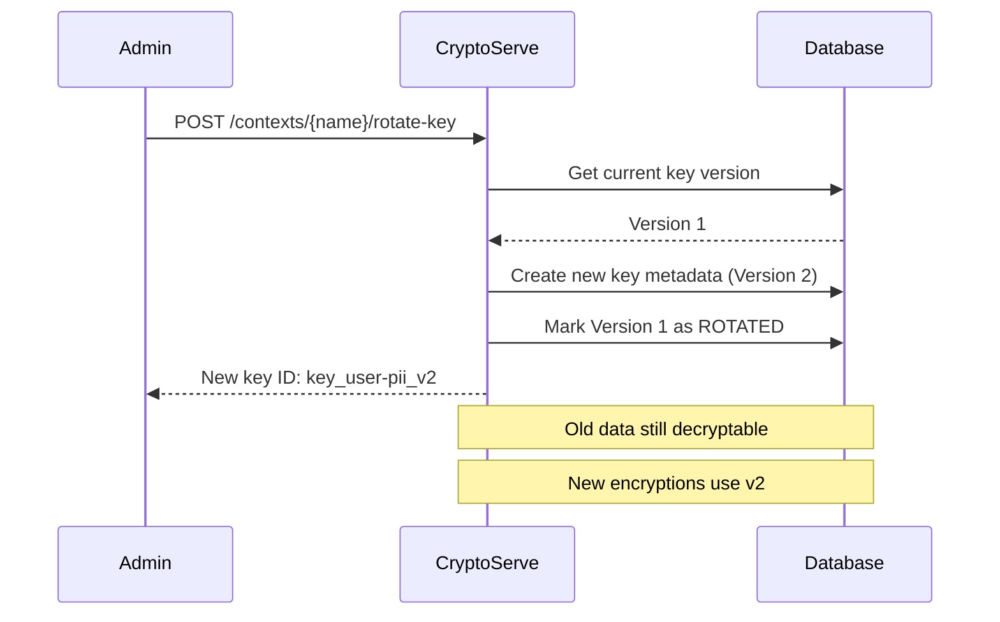
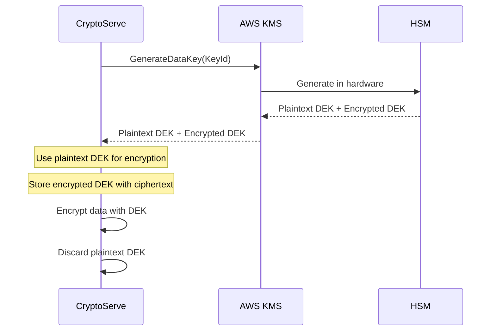

# Key Management

CryptoServe implements a hierarchical key management system designed for security, scalability, and operational simplicity.

## Key Hierarchy

```
                    ┌─────────────────────┐
                    │     Master Key      │
                    │    (Root of Trust)  │
                    └──────────┬──────────┘
                               │
                               │ HKDF-SHA256
                               │
            ┌──────────────────┼──────────────────┐
            │                  │                  │
            ▼                  ▼                  ▼
    ┌───────────────┐  ┌───────────────┐  ┌───────────────┐
    │ Context DEK   │  │ Context DEK   │  │ Context DEK   │
    │  (user-pii)   │  │ (payment-data)│  │  (health-data)│
    └───────────────┘  └───────────────┘  └───────────────┘
```

## Key Types

### Master Key (KEK)

The root of the key hierarchy. All other keys are derived from this.

| Property | Value |
|----------|-------|
| Size | 256 bits minimum |
| Source | Environment variable or KMS |
| Storage | Never stored (in production: HSM/KMS) |
| Lifetime | Indefinite (rotate via KMS) |

```bash
# Generate a secure master key
python -c "import secrets; print(secrets.token_hex(32))"
```

### Data Encryption Keys (DEKs)

Per-context keys derived from the master key.

| Property | Value |
|----------|-------|
| Size | 128 or 256 bits |
| Derivation | HKDF-SHA256 |
| Storage | Derived on demand (not stored) |
| Rotation | New version = new derivation |

### Application Signing Keys

Ed25519 keypairs for JWT signing.

| Property | Value |
|----------|-------|
| Algorithm | Ed25519 |
| Size | 256 bits (private), 256 bits (public) |
| Storage | Private key encrypted at rest |
| Lifetime | Per-application (rotate on compromise) |

### PQC Keys

Post-quantum keys for hybrid encryption.

| Property | Value |
|----------|-------|
| Algorithms | ML-KEM-768/1024, ML-DSA-65/87 |
| Storage | Private key encrypted with AES-256-GCM |
| Lifetime | Context-bound |

---

## Key Derivation

CryptoServe uses HKDF (HMAC-based Key Derivation Function) per [RFC 5869](https://tools.ietf.org/html/rfc5869).

### Algorithm

```
DEK = HKDF-SHA256(
    IKM = master_key,
    salt = "crypto-serve-v1",
    info = "{tenant_id}:{context}:{version}:{key_size}",
    length = key_size / 8
)
```

### Implementation

```python
# app/core/key_manager.py
from cryptography.hazmat.primitives.kdf.hkdf import HKDF
from cryptography.hazmat.primitives import hashes

def derive_key(
    context: str,
    tenant_id: str,
    version: int = 1,
    key_size: int = 256
) -> bytes:
    """Derive a context-specific DEK."""
    info = f"{tenant_id}:{context}:{version}:{key_size}".encode()

    hkdf = HKDF(
        algorithm=hashes.SHA256(),
        length=key_size // 8,
        salt=b"crypto-serve-v1",
        info=info
    )

    return hkdf.derive(master_key)
```

### Security Properties

1. **Domain Separation**: The `info` parameter ensures keys for different contexts/tenants are cryptographically independent
2. **Versioning**: Key versions enable rotation without re-encryption
3. **Deterministic**: Same inputs always produce same key (enables stateless operation)

---

## Key Rotation

### Why Rotate?

- Limit exposure if a key is compromised
- Comply with regulatory requirements
- Respond to personnel changes
- Update to stronger algorithms

### How It Works



### Key States

| State | New Encryptions | Decryptions |
|-------|-----------------|-------------|
| `ACTIVE` | Yes | Yes |
| `ROTATED` | No | Yes |
| `REVOKED` | No | No |

### API

```bash
# Rotate key for a context
curl -X POST http://localhost:8003/api/admin/contexts/user-pii/rotate-key \
  -H "Authorization: Bearer $ADMIN_TOKEN"
```

### Ciphertext Compatibility

The key ID is stored in the ciphertext header:

```json
{
  "kid": "key_user-pii_v1_abc123"
}
```

During decryption, CryptoServe:

1. Extracts `kid` from ciphertext
2. Looks up key version (v1)
3. Derives that specific version's key
4. Decrypts successfully

**No re-encryption needed!**

---

## KMS Integration

For production deployments, use a cloud KMS instead of environment variables.

### AWS KMS

```python
# Configuration
KMS_PROVIDER=aws
AWS_KMS_KEY_ID=arn:aws:kms:us-east-1:123456789:key/abc123
AWS_REGION=us-east-1
```

**How it works:**



### Envelope Encryption

With KMS, CryptoServe uses envelope encryption:

1. Request a data key from KMS
2. KMS returns plaintext DEK + encrypted DEK
3. Encrypt data with plaintext DEK
4. Store encrypted DEK alongside ciphertext
5. Discard plaintext DEK

**Benefits:**

- Master key never leaves HSM
- Each message can have unique DEK
- DEK rotation is KMS-managed

### Google Cloud KMS

```python
KMS_PROVIDER=gcp
GCP_KMS_KEY_ID=projects/my-project/locations/global/keyRings/my-ring/cryptoKeys/my-key
```

### HashiCorp Vault

```python
KMS_PROVIDER=vault
VAULT_ADDR=https://vault.example.com
VAULT_TOKEN=s.xxxxx
VAULT_TRANSIT_KEY=cryptoserve-master
```

---

## PQC Key Storage

Post-quantum keys cannot be derived deterministically and must be stored:

### Generation

```python
import oqs

def generate_pqc_keypair(algorithm: str = "ML-KEM-768"):
    """Generate a post-quantum keypair."""
    kem = oqs.KeyEncapsulation(algorithm)
    public_key = kem.generate_keypair()
    private_key = kem.export_secret_key()
    return public_key, private_key
```

### Storage

Private keys are encrypted with a context-derived key:

```python
def store_pqc_private_key(
    private_key: bytes,
    context: str,
    key_id: str
) -> bytes:
    """Encrypt and store PQC private key."""
    # Derive encryption key for this context
    encryption_key = derive_key(f"pqc-storage:{context}", version=1)

    # Encrypt private key
    nonce = secrets.token_bytes(12)
    cipher = AESGCM(encryption_key)
    encrypted = cipher.encrypt(
        nonce,
        private_key,
        associated_data=f"{context}:{key_id}".encode()
    )

    return nonce + encrypted
```

### Retrieval

```python
def load_pqc_private_key(
    encrypted_key: bytes,
    context: str,
    key_id: str
) -> bytes:
    """Decrypt and return PQC private key."""
    encryption_key = derive_key(f"pqc-storage:{context}", version=1)

    nonce = encrypted_key[:12]
    ciphertext = encrypted_key[12:]

    cipher = AESGCM(encryption_key)
    return cipher.decrypt(
        nonce,
        ciphertext,
        associated_data=f"{context}:{key_id}".encode()
    )
```

---

## Security Considerations

### Master Key Protection

| Environment | Recommendation |
|-------------|----------------|
| Development | Environment variable (acceptable) |
| Staging | Secrets manager (e.g., AWS Secrets Manager) |
| Production | HSM/KMS (required) |

### Key Derivation Limits

HKDF with SHA-256 can safely derive up to 255 × 32 = 8,160 bytes per derivation. For 256-bit keys, this is effectively unlimited.

### Memory Security

```python
from app.core.secure_memory import SecureBytes

# Keys are zeroized when no longer needed
with SecureBytes(derived_key) as key:
    ciphertext = encrypt(key.data, plaintext)
# Key memory zeroed here
```

**Limitations:**

- Python's GC may leave copies
- Compiler optimizations may skip zeroization
- This is best-effort, not guaranteed

### Audit Trail

All key operations are logged:

```json
{
  "timestamp": "2024-01-15T10:30:00Z",
  "operation": "key_derivation",
  "context": "user-pii",
  "key_version": 1,
  "identity_id": "id_abc123",
  "success": true
}
```

---

## Best Practices

### 1. Use KMS in Production

Never use environment variables for the master key in production:

```bash
# Development only
CRYPTOSERVE_MASTER_KEY=dev-key-not-for-production

# Production
KMS_PROVIDER=aws
AWS_KMS_KEY_ID=arn:aws:kms:...
```

### 2. Rotate Keys Regularly

Set up automated rotation:

```bash
# Rotate all context keys monthly
0 0 1 * * curl -X POST http://localhost:8003/api/admin/rotate-all-keys
```

### 3. Monitor Key Usage

Track key operations in your monitoring system:

- Derivations per minute
- Rotation events
- Failed decryptions (may indicate key issues)

### 4. Backup Strategy

For KMS:
- Enable automatic key rotation
- Cross-region replication for disaster recovery

For local keys:
- Document recovery procedures
- Test recovery annually
