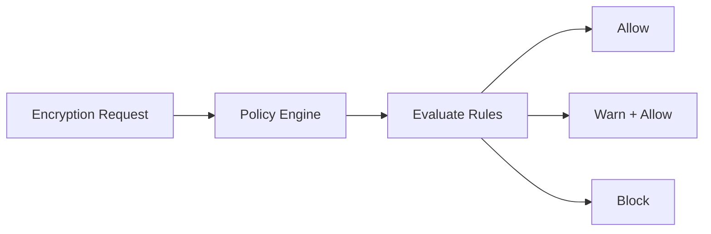

# Policy Engine

CryptoServe's policy engine enforces cryptographic standards at runtime, ensuring compliance and security.

## Overview

The policy engine evaluates rules before every cryptographic operation:



## Policy Types

### Algorithm Policies

Control which algorithms can be used:

```json
{
  "type": "algorithm",
  "name": "require-256-bit-keys",
  "rule": {
    "min_key_bits": 256,
    "blocked_algorithms": ["AES-128-*", "DES", "3DES", "RC4"]
  },
  "severity": "block"
}
```

### Compliance Policies

Enforce regulatory requirements:

```json
{
  "type": "compliance",
  "name": "hipaa-encryption",
  "rule": {
    "require_algorithms": ["AES-256-GCM", "AES-256-CBC"],
    "require_audit": true,
    "require_key_rotation_days": 365
  },
  "severity": "block",
  "applies_to": ["health-data"]
}
```

### Custom Policies

Define business-specific rules:

```json
{
  "type": "custom",
  "name": "production-only-pqc",
  "rule": {
    "expression": "context.environment == 'production' && algorithm.contains('ML-KEM')"
  },
  "severity": "warn"
}
```

---

## Severity Levels

| Level | Behavior | Use Case |
|-------|----------|----------|
| `info` | Log only | Monitoring, metrics |
| `warn` | Log + warning in response | Deprecation notices |
| `block` | Reject operation | Security enforcement |

---

## Built-in Policies

CryptoServe includes default policies:

### Block Deprecated Algorithms

```python
{
    "name": "block-deprecated",
    "blocked": ["DES", "3DES", "RC4", "MD5", "SHA1"],
    "severity": "block"
}
```

### Warn on Non-FIPS in FIPS Mode

```python
{
    "name": "fips-warning",
    "condition": "fips_mode == 'preferred' and not algorithm.fips_approved",
    "severity": "warn"
}
```

### Require Audit for Sensitive Data

```python
{
    "name": "sensitive-audit",
    "condition": "context.sensitivity in ['high', 'critical']",
    "require_audit": True,
    "severity": "block"
}
```

---

## Creating Policies

### Via Dashboard

1. Navigate to **Policies** → **Create New**
2. Select policy type
3. Configure rules
4. Set severity and scope

### Via API

```bash
curl -X POST http://localhost:8003/api/policies \
  -H "Authorization: Bearer $TOKEN" \
  -H "Content-Type: application/json" \
  -d '{
    "name": "require-quantum-resistant",
    "description": "Require PQC for long-term data",
    "type": "algorithm",
    "rule": {
      "require_quantum_resistant": true
    },
    "severity": "warn",
    "enabled": true,
    "applies_to": ["long-term-secrets", "archive-data"]
  }'
```

---

## Policy Evaluation

### Order of Evaluation

1. **Global policies** (apply to all operations)
2. **Context-specific policies** (apply to specific contexts)
3. **Identity-specific policies** (apply to specific identities)

### Evaluation Logic

```python
# app/core/policy_engine.py
async def evaluate_policies(
    context: Context,
    algorithm: str,
    identity: Identity
) -> PolicyResult:
    """Evaluate all applicable policies."""
    violations = []
    warnings = []

    for policy in get_applicable_policies(context, identity):
        result = evaluate_policy(policy, algorithm, context)

        if result.violated:
            if policy.severity == "block":
                violations.append(result)
            elif policy.severity == "warn":
                warnings.append(result)

    if violations:
        raise PolicyViolationError(violations)

    return PolicyResult(
        allowed=True,
        warnings=warnings
    )
```

### Response Format

**Successful with warnings:**

```json
{
  "ciphertext": "...",
  "warnings": [
    {
      "policy": "quantum-readiness",
      "message": "Consider using hybrid PQC for data with 10+ year retention"
    }
  ]
}
```

**Blocked:**

```json
{
  "error": "policy_violation",
  "violations": [
    {
      "policy": "require-256-bit-keys",
      "message": "AES-128-GCM does not meet minimum key size requirement (256 bits)"
    }
  ]
}
```

---

## Context-Level Policies

Attach policies to specific contexts:

### Algorithm Policy

```json
{
  "algorithm_policy": {
    "allowed_algorithms": ["AES-256-GCM", "AES-256-GCM+ML-KEM-768"],
    "blocked_algorithms": ["ChaCha20-*"],
    "min_key_bits": 256
  },
  "policy_enforcement": "enforce"
}
```

### Enforcement Modes

| Mode | Behavior |
|------|----------|
| `none` | No enforcement |
| `warn` | Log warnings but allow |
| `enforce` | Block violations |

---

## Testing Policies

### Dry Run Evaluation

Test policies without performing operations:

```bash
curl -X POST http://localhost:8003/api/policies/evaluate \
  -H "Authorization: Bearer $TOKEN" \
  -d '{
    "context": "user-pii",
    "algorithm": "AES-128-GCM",
    "operation": "encrypt"
  }'
```

**Response:**

```json
{
  "allowed": false,
  "violations": [
    {
      "policy": "require-256-bit-keys",
      "severity": "block",
      "message": "Algorithm does not meet minimum key size"
    }
  ],
  "warnings": []
}
```

### Policy Simulation

Test new policies before enabling:

```bash
curl -X POST http://localhost:8003/api/policies/simulate \
  -H "Authorization: Bearer $TOKEN" \
  -d '{
    "policy": {
      "name": "test-policy",
      "rule": {"min_key_bits": 256}
    },
    "sample_operations": 100
  }'
```

**Response:**

```json
{
  "would_block": 23,
  "would_warn": 0,
  "would_allow": 77,
  "sample_violations": [
    {"operation_id": "...", "reason": "AES-128-GCM < 256 bits"}
  ]
}
```

---

## Common Policies

### PCI-DSS Compliance

```json
{
  "name": "pci-dss-encryption",
  "description": "PCI-DSS encryption requirements",
  "type": "compliance",
  "rule": {
    "require_algorithms": ["AES-256-GCM", "AES-256-CBC"],
    "min_key_bits": 256,
    "require_audit": true,
    "require_key_rotation_days": 365
  },
  "severity": "block",
  "applies_to": ["payment-data"]
}
```

### HIPAA Compliance

```json
{
  "name": "hipaa-encryption",
  "description": "HIPAA encryption requirements",
  "type": "compliance",
  "rule": {
    "require_algorithms": ["AES-256-GCM"],
    "require_audit": true,
    "require_access_logging": true
  },
  "severity": "block",
  "applies_to": ["health-data"]
}
```

### Quantum Readiness

```json
{
  "name": "quantum-readiness",
  "description": "Encourage PQC for long-term data",
  "type": "algorithm",
  "rule": {
    "require_quantum_resistant": true
  },
  "severity": "warn",
  "applies_to": ["long-term-secrets", "archive"]
}
```

### Development Environment

```json
{
  "name": "dev-relaxed",
  "description": "Relaxed policies for development",
  "type": "environment",
  "rule": {
    "allow_all_algorithms": true,
    "skip_audit": true
  },
  "severity": "info",
  "condition": "environment == 'development'"
}
```

---

## Audit Integration

Policy evaluations are logged:

```json
{
  "timestamp": "2024-01-15T10:30:00Z",
  "operation": "encrypt",
  "context": "user-pii",
  "algorithm_requested": "AES-128-GCM",
  "policies_evaluated": [
    {"name": "require-256-bit-keys", "result": "violated"}
  ],
  "final_result": "blocked",
  "identity_id": "id_abc123"
}
```

Query policy violations:

```bash
curl "http://localhost:8003/api/audit?policy_violation=true" \
  -H "Authorization: Bearer $TOKEN"
```

---

## Best Practices

### 1. Start with Warnings

Deploy new policies in `warn` mode first:

```json
{
  "severity": "warn"
}
```

Monitor for a week, then switch to `block`.

### 2. Use Context Scoping

Apply strict policies only where needed:

```json
{
  "applies_to": ["payment-data", "health-data"]
}
```

### 3. Document Policy Rationale

```json
{
  "name": "require-256-bit-keys",
  "description": "NIST recommends 256-bit keys for data protected beyond 2030. See SP 800-57.",
  "reference_url": "https://csrc.nist.gov/publications/detail/sp/800-57-part-1/rev-5/final"
}
```

### 4. Test Before Deployment

Always use dry run evaluation:

```bash
curl -X POST /api/policies/evaluate -d '{...}'
```

### 5. Review Regularly

- Quarterly policy review
- Update for new compliance requirements
- Retire obsolete policies
