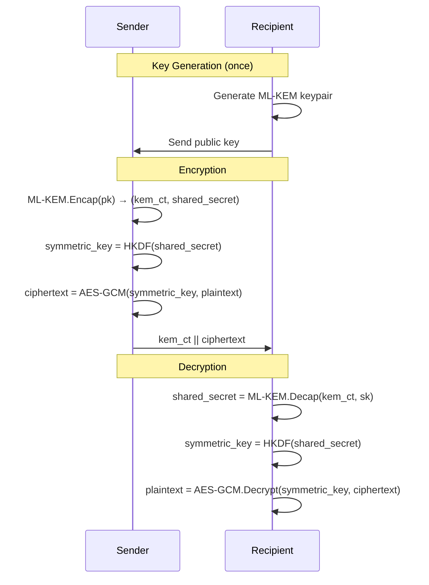

# Post-Quantum Cryptography

CryptoServe provides first-class support for NIST-standardized post-quantum cryptographic algorithms.

## Why Post-Quantum?

Current public-key cryptography (RSA, ECDH, ECDSA) relies on mathematical problems that quantum computers can solve efficiently using Shor's algorithm.

| Algorithm | Classical Security | Quantum Security |
|-----------|-------------------|------------------|
| RSA-2048 | ~112 bits | **Broken** |
| ECDH P-256 | ~128 bits | **Broken** |
| AES-256 | 256 bits | ~128 bits (Grover's) |
| ML-KEM-768 | ~192 bits | ~192 bits |

**"Harvest Now, Decrypt Later"**: Adversaries may be collecting encrypted data today to decrypt when quantum computers become available.

---

## Supported Algorithms

CryptoServe implements NIST-standardized post-quantum algorithms via [liboqs](https://openquantumsafe.org/).

### ML-KEM (FIPS 203)

Module Lattice-based Key Encapsulation Mechanism (formerly Kyber).

| Variant | Security Level | Public Key | Ciphertext | Shared Secret |
|---------|----------------|------------|------------|---------------|
| ML-KEM-512 | Level 1 (128-bit) | 800 B | 768 B | 32 B |
| ML-KEM-768 | Level 3 (192-bit) | 1,184 B | 1,088 B | 32 B |
| ML-KEM-1024 | Level 5 (256-bit) | 1,568 B | 1,568 B | 32 B |

**Use case:** Key encapsulation for hybrid encryption

### ML-DSA (FIPS 204)

Module Lattice-based Digital Signature Algorithm (formerly Dilithium).

| Variant | Security Level | Public Key | Signature |
|---------|----------------|------------|-----------|
| ML-DSA-44 | Level 2 (~128-bit) | 1,312 B | 2,420 B |
| ML-DSA-65 | Level 3 (~192-bit) | 1,952 B | 3,309 B |
| ML-DSA-87 | Level 5 (~256-bit) | 2,592 B | 4,627 B |

**Use case:** Post-quantum digital signatures

---

## Hybrid Encryption

CryptoServe recommends **hybrid encryption** that combines classical and post-quantum algorithms:

```
Security = Classical AND Post-Quantum
```

If either algorithm is secure, the data remains protected.

### How It Works



### Implementation

```python title="app/core/hybrid_crypto.py"
import oqs
from cryptography.hazmat.primitives.kdf.hkdf import HKDF
from cryptography.hazmat.primitives.ciphers.aead import AESGCM

class HybridEncryption:
    def __init__(self, algorithm: str = "ML-KEM-768"):
        self.kem = oqs.KeyEncapsulation(algorithm)

    def encrypt(self, public_key: bytes, plaintext: bytes) -> bytes:
        """Hybrid encrypt using ML-KEM + AES-256-GCM."""
        # 1. KEM encapsulation
        kem_ciphertext, shared_secret = self.kem.encap_secret(public_key)

        # 2. Derive symmetric key
        symmetric_key = HKDF(
            algorithm=hashes.SHA256(),
            length=32,
            salt=None,
            info=b"cryptoserve-hybrid-v1"
        ).derive(shared_secret)

        # 3. AEAD encryption
        nonce = os.urandom(12)
        cipher = AESGCM(symmetric_key)
        aead_ciphertext = cipher.encrypt(nonce, plaintext, None)

        # 4. Pack output
        return self._pack(kem_ciphertext, nonce, aead_ciphertext)

    def decrypt(self, private_key: bytes, ciphertext: bytes) -> bytes:
        """Hybrid decrypt."""
        # 1. Unpack
        kem_ciphertext, nonce, aead_ciphertext = self._unpack(ciphertext)

        # 2. KEM decapsulation
        shared_secret = self.kem.decap_secret(kem_ciphertext)

        # 3. Derive symmetric key
        symmetric_key = HKDF(
            algorithm=hashes.SHA256(),
            length=32,
            salt=None,
            info=b"cryptoserve-hybrid-v1"
        ).derive(shared_secret)

        # 4. AEAD decryption
        cipher = AESGCM(symmetric_key)
        return cipher.decrypt(nonce, aead_ciphertext, None)
```

---

## Using PQC in CryptoServe

### Enable for a Context

Configure a context with quantum threat consideration:

```bash
curl -X POST http://localhost:8001/api/contexts \
  -H "Authorization: Bearer $TOKEN" \
  -d '{
    "name": "long-term-secrets",
    "display_name": "Long-term Secrets",
    "config": {
      "data_identity": {
        "sensitivity": "critical"
      },
      "threat_model": {
        "quantum_threat": true,
        "protection_duration_years": 15
      }
    }
  }'
```

The algorithm resolver will select `AES-256-GCM+ML-KEM-768`.

### Direct API Usage

```bash
# Encrypt with hybrid mode
curl -X POST http://localhost:8001/v1/crypto/encrypt \
  -H "Authorization: Bearer $TOKEN" \
  -d '{
    "plaintext": "c2VjcmV0IGRhdGE=",
    "context": "long-term-secrets",
    "algorithm": "AES-256-GCM+ML-KEM-768"
  }'
```

### SDK Usage

```python
from cryptoserve import CryptoServe

crypto = CryptoServe(app_name="my-app", team="platform")

# Encrypt with hybrid PQC
ciphertext = crypto.encrypt_string(
    "nuclear launch codes",
    context="long-term-secrets"
)
# Algorithm automatically selected based on context config
```

---

## Key Management for PQC

### Key Generation

```python
# Generate ML-KEM keypair
public_key, private_key = crypto.generate_pqc_keypair(
    algorithm="ML-KEM-768",
    context="long-term-secrets"
)
```

### Key Storage

PQC private keys are stored encrypted:

```
┌────────────────────────────────────────────────────┐
│                 PQC Key Record                      │
├────────────────────────────────────────────────────┤
│ key_id: "pqc_long-term-secrets_abc123"             │
│ algorithm: "ML-KEM-768"                            │
│ public_key: <1,184 bytes>                          │
│ encrypted_private_key: AES-GCM(<secret key>)       │
│ created_at: "2024-01-15T10:00:00Z"                 │
│ status: "active"                                    │
└────────────────────────────────────────────────────┘
```

### Key Rotation

```bash
# Rotate PQC keys for a context
curl -X POST http://localhost:8001/api/admin/contexts/long-term-secrets/rotate-pqc-key
```

---

## Hybrid Ciphertext Format

```
┌─────────────────────────────────────────────────────────────┐
│  Header Length (2 bytes, big-endian)                        │
├─────────────────────────────────────────────────────────────┤
│  Header (JSON)                                              │
│  {                                                          │
│    "v": 1,                                                  │
│    "mode": "AES-256-GCM+ML-KEM-768",                        │
│    "kid": "pqc_long-term-secrets_abc123",                   │
│    "nonce": "base64...",                                    │
│    "kem_ct_len": 1088                                       │
│  }                                                          │
├─────────────────────────────────────────────────────────────┤
│  KEM Ciphertext (1,088 bytes for ML-KEM-768)                │
├─────────────────────────────────────────────────────────────┤
│  AEAD Ciphertext + Auth Tag                                 │
└─────────────────────────────────────────────────────────────┘
```

---

## Performance Considerations

### Overhead Comparison

| Algorithm | Encrypt (μs) | Decrypt (μs) | Ciphertext Overhead |
|-----------|--------------|--------------|---------------------|
| AES-256-GCM | ~1 | ~1 | 28 bytes |
| AES-GCM + ML-KEM-768 | ~50 | ~50 | 1,116 bytes |
| AES-GCM + ML-KEM-1024 | ~80 | ~80 | 1,596 bytes |

### When to Use PQC

| Scenario | Recommendation |
|----------|----------------|
| Session tokens (hours) | Classical only |
| User data (years) | Consider hybrid |
| Government secrets (decades) | Hybrid required |
| High-frequency API (1000+ req/s) | Classical with PQC upgrade path |

### Optimization Tips

1. **Batch operations**: Amortize KEM overhead across multiple encryptions
2. **Key caching**: Cache decrypted symmetric keys for repeated operations
3. **Algorithm selection**: Use ML-KEM-768 (Level 3) unless regulations require Level 5

---

## FIPS Compliance

ML-KEM and ML-DSA are NIST-standardized:

| Algorithm | Standard | FIPS Status |
|-----------|----------|-------------|
| ML-KEM | FIPS 203 | Approved |
| ML-DSA | FIPS 204 | Approved |
| SLH-DSA | FIPS 205 | Approved (not yet in CryptoServe) |

```bash
# Enable FIPS mode with PQC
FIPS_MODE=enabled
# ML-KEM and ML-DSA remain available
```

---

## Migration Path

### Phase 1: Awareness

1. Audit data sensitivity and retention periods
2. Identify data requiring long-term protection
3. Inventory current cryptographic algorithms

### Phase 2: Hybrid Deployment

1. Create PQC-enabled contexts for sensitive data
2. Configure quantum threat in context model
3. Existing data remains readable

### Phase 3: Full PQC (Future)

When classical algorithms are deprecated:

1. Re-encrypt legacy data with PQC
2. Update contexts to PQC-only
3. Retire classical algorithms

---

## Security Considerations

### Not a Mock Implementation

CryptoServe uses real liboqs implementations:

```python
import oqs
print(oqs.get_enabled_KEM_mechanisms())
# ['ML-KEM-512', 'ML-KEM-768', 'ML-KEM-1024', ...]
```

### Side-Channel Resistance

liboqs implementations include:

- Constant-time operations
- Protection against timing attacks
- Memory access pattern obfuscation

### Cryptographic Agility

The hybrid approach ensures:

- Security if PQC algorithms have undiscovered weaknesses
- Continued protection if quantum computers arrive sooner than expected
- Smooth migration path as standards evolve

---

## Further Reading

- [NIST Post-Quantum Cryptography](https://csrc.nist.gov/projects/post-quantum-cryptography)
- [FIPS 203: ML-KEM Standard](https://csrc.nist.gov/pubs/fips/203/final)
- [FIPS 204: ML-DSA Standard](https://csrc.nist.gov/pubs/fips/204/final)
- [Open Quantum Safe Project](https://openquantumsafe.org/)
- [CryptoServe Security Whitepaper](../security/whitepaper.md)
