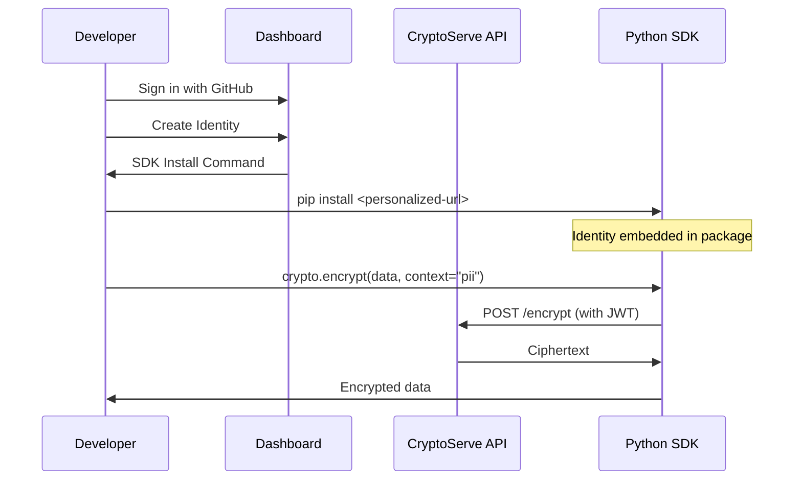

# CryptoServe Documentation

Cryptography-as-a-Service with Zero Configuration SDKs

Eliminate the complexity of implementing encryption correctly. Download a personalized SDK with your identity embedded, then encrypt and decrypt with a single line of code.

- [Get Started](getting-started/quickstart.md)
- [View on GitHub](https://github.com/ecolibria/cryptoserve)
- [API Docs](api-reference/index.md)

---

> **Interactive API Documentation**
>
> **Try the API instantly** with the OpenAPI-powered documentation available when the server is running:
>
> - **Swagger UI** (`/docs`) — Interactive API explorer with live request testing
> - **ReDoc** (`/redoc`) — Three-panel documentation with search
> - **OpenAPI Spec** (`/openapi.json`) — Import into Postman, Insomnia, or generate client SDKs

---

## Features

| Feature | Description | Link |
|---------|-------------|------|
| **Zero Configuration** | Download a personalized SDK with your identity embedded. No API keys to configure, no secrets to manage. | [Quick Start](getting-started/quickstart.md) |
| **Enterprise Security** | AES-256-GCM with key commitment, HKDF key derivation, Ed25519 authentication, and FIPS compliance modes. | [Technical Reference](security/technical-reference.md) |
| **Post-Quantum Ready** | NIST-standardized ML-KEM and ML-DSA algorithms via liboqs. Hybrid modes for defense in depth. | [PQC Guide](concepts/post-quantum.md) |
| **Policy Engine** | Enforce cryptographic standards at runtime. Block deprecated algorithms, require minimum key sizes, ensure compliance. | [Policy Engine](concepts/policy-engine.md) |

---

## How It Works



---

## Quick Example

### Python

```python
from cryptoserve import CryptoServe

crypto = CryptoServe(app_name="my-app", team="platform")

# Encrypt sensitive data
ciphertext = crypto.encrypt_string(
    "John Doe, SSN: 123-45-6789",
    context="user-pii"
)

# Decrypt when needed
plaintext = crypto.decrypt_string(ciphertext, context="user-pii")
```

### TypeScript

```typescript
import { crypto } from '@cryptoserve/sdk';

// Encrypt sensitive data
const ciphertext = await crypto.encrypt(
  "John Doe, SSN: 123-45-6789",
  { context: "user-pii" }
);

// Decrypt when needed
const plaintext = await crypto.decrypt(ciphertext);
```

### cURL

```bash
# Encrypt
curl -X POST https://your-server/v1/crypto/encrypt \
  -H "Authorization: Bearer $TOKEN" \
  -H "Content-Type: application/json" \
  -d '{"plaintext": "SGVsbG8gV29ybGQ=", "context": "user-pii"}'

# Decrypt
curl -X POST https://your-server/v1/crypto/decrypt \
  -H "Authorization: Bearer $TOKEN" \
  -H "Content-Type: application/json" \
  -d '{"ciphertext": "..."}'
```

---

## 5-Layer Context Model

CryptoServe automatically selects the optimal cryptographic algorithm based on five layers of context:

| Layer | Purpose | Examples |
|-------|---------|----------|
| **Data Identity** | What is being protected | PII, PHI, PCI, secrets |
| **Regulatory** | Compliance requirements | HIPAA, PCI-DSS, GDPR |
| **Threat Model** | Who are you protecting against | Nation states, quantum threats |
| **Access Patterns** | How data is used | High frequency, low latency |
| **Technical** | Infrastructure constraints | Hardware acceleration, FIPS mode |

See [Context Model](concepts/context-model.md) for details.

---

## Supported Algorithms

### Symmetric Encryption

| Algorithm | Key Size | FIPS | Use Case |
|-----------|----------|------|----------|
| AES-256-GCM | 256-bit | Yes | Default, authenticated encryption |
| AES-128-GCM | 128-bit | Yes | Performance-sensitive |
| ChaCha20-Poly1305 | 256-bit | No | Software-only environments |
| AES-256-CBC + HMAC | 256-bit | Yes | Legacy compatibility |

### Post-Quantum (NIST Standards)

| Algorithm | Standard | Security Level | Use Case |
|-----------|----------|----------------|----------|
| ML-KEM-768 | FIPS 203 | Level 3 | Key encapsulation |
| ML-KEM-1024 | FIPS 203 | Level 5 | Maximum security |
| ML-DSA-65 | FIPS 204 | Level 3 | Digital signatures |
| ML-DSA-87 | FIPS 204 | Level 5 | Maximum security |

See [Algorithm Reference](security/technical-reference.md#appendix-a-algorithm-reference) for the full list.

---

## Why CryptoServe?

**Developers**

- Zero configuration — works immediately after import
- No key management — keys handled server-side
- Type-safe SDKs — full IDE support
- Self-documenting — ciphertext includes metadata

**Security Teams**

- Policy enforcement — runtime algorithm validation
- Complete audit trail — every operation logged
- Key rotation — no re-encryption needed
- Compliance ready — HIPAA, PCI-DSS, GDPR

**Operations Teams**

- Self-service — dashboard for identity management
- Observable — metrics and analytics built-in
- Scalable — stateless API design
- Cloud-native — KMS integration support

---

## Getting Started

| Resource | Description | Link |
|----------|-------------|------|
| **Installation** | Install CryptoServe server and SDKs | [Install Guide](getting-started/installation.md) |
| **Quick Start** | Your first encryption in 5 minutes | [Quick Start](getting-started/quickstart.md) |
| **Configuration** | Environment variables and options | [Configuration](getting-started/configuration.md) |
| **Concepts** | Understand the architecture | [Concepts](concepts/index.md) |
