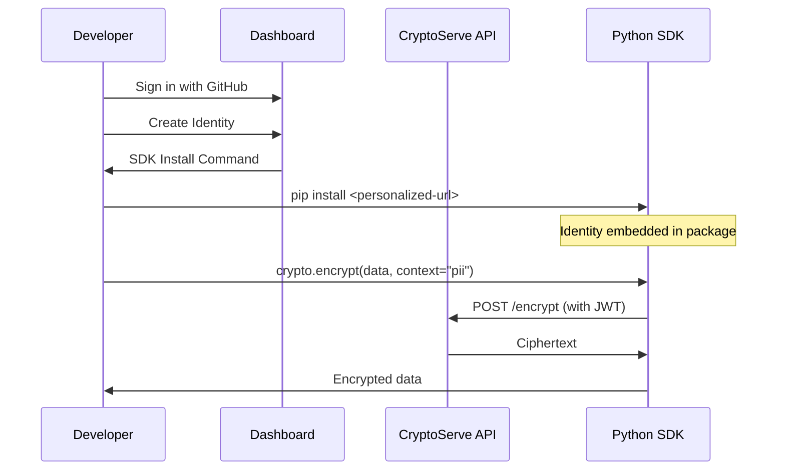

<style>
.md-typeset h1 {
  display: none;
}
</style>

<div class="hero" markdown>

# **CryptoServe**

### Cryptography-as-a-Service with Zero Configuration SDKs

Eliminate the complexity of implementing encryption correctly. Download a personalized SDK with your identity embedded, then encrypt and decrypt with a single line of code.

[Get Started](getting-started/quickstart.md){ .md-button .md-button--primary }
[View on GitHub](https://github.com/keytum/crypto-serve){ .md-button }
[API Docs :material-api:](http://localhost:8001/docs){ .md-button }

</div>

---

!!! example "Interactive API Documentation"
    **Try the API instantly** with our OpenAPI-powered documentation:

    - **[Swagger UI](/docs)** - Interactive API explorer with live request testing
    - **[ReDoc](/redoc)** - Three-panel documentation with search
    - **[OpenAPI Spec](/openapi.json)** - Import into Postman, Insomnia, or generate client SDKs

---

<div class="grid cards" markdown>

-   :material-rocket-launch:{ .lg .middle } **Zero Configuration**

    ---

    Download a personalized SDK with your identity embedded. No API keys to configure, no secrets to manage.

    [:octicons-arrow-right-24: Quick Start](getting-started/quickstart.md)

-   :material-shield-lock:{ .lg .middle } **Enterprise Security**

    ---

    AES-256-GCM with key commitment, HKDF key derivation, Ed25519 authentication, and FIPS compliance modes.

    [:octicons-arrow-right-24: Security Whitepaper](security/whitepaper.md)

-   :material-atom:{ .lg .middle } **Post-Quantum Ready**

    ---

    NIST-standardized ML-KEM and ML-DSA algorithms via liboqs. Hybrid modes for defense in depth.

    [:octicons-arrow-right-24: PQC Guide](concepts/post-quantum.md)

-   :material-scale-balance:{ .lg .middle } **Policy Engine**

    ---

    Enforce cryptographic standards at runtime. Block deprecated algorithms, require minimum key sizes, ensure compliance.

    [:octicons-arrow-right-24: Policy Engine](concepts/policy-engine.md)

</div>

---

## How It Works



---

## Quick Example

=== "Python"

    ```python
    from cryptoserve import crypto

    # Encrypt sensitive data
    ciphertext = crypto.encrypt_string(
        "John Doe, SSN: 123-45-6789",
        context="user-pii"
    )

    # Decrypt when needed
    plaintext = crypto.decrypt_string(ciphertext)
    ```

=== "TypeScript"

    ```typescript
    import { crypto } from '@cryptoserve/sdk';

    // Encrypt sensitive data
    const ciphertext = await crypto.encrypt(
      "John Doe, SSN: 123-45-6789",
      { context: "user-pii" }
    );

    // Decrypt when needed
    const plaintext = await crypto.decrypt(ciphertext);
    ```

=== "cURL"

    ```bash
    # Encrypt
    curl -X POST https://api.cryptoserve.io/v1/crypto/encrypt \
      -H "Authorization: Bearer $TOKEN" \
      -H "Content-Type: application/json" \
      -d '{"plaintext": "SGVsbG8gV29ybGQ=", "context": "user-pii"}'

    # Decrypt
    curl -X POST https://api.cryptoserve.io/v1/crypto/decrypt \
      -H "Authorization: Bearer $TOKEN" \
      -H "Content-Type: application/json" \
      -d '{"ciphertext": "..."}'
    ```

---

## 5-Layer Context Model

CryptoServe automatically selects the optimal cryptographic algorithm based on five layers of context:

| Layer | Purpose | Examples |
|-------|---------|----------|
| **Data Identity** | What is being protected | PII, PHI, PCI, secrets |
| **Regulatory** | Compliance requirements | HIPAA, PCI-DSS, GDPR |
| **Threat Model** | Who are you protecting against | Nation states, quantum threats |
| **Access Patterns** | How data is used | High frequency, low latency |
| **Technical** | Infrastructure constraints | Hardware acceleration, FIPS mode |

[:octicons-arrow-right-24: Learn more about the context model](concepts/context-model.md)

---

## Supported Algorithms

### Symmetric Encryption

| Algorithm | Key Size | FIPS | Use Case |
|-----------|----------|------|----------|
| AES-256-GCM | 256-bit | :white_check_mark: | Default, authenticated encryption |
| AES-128-GCM | 128-bit | :white_check_mark: | Performance-sensitive |
| ChaCha20-Poly1305 | 256-bit | :x: | Software-only environments |
| AES-256-CBC + HMAC | 256-bit | :white_check_mark: | Legacy compatibility |

### Post-Quantum (NIST Standards)

| Algorithm | Standard | Security Level | Use Case |
|-----------|----------|----------------|----------|
| ML-KEM-768 | FIPS 203 | Level 3 | Key encapsulation |
| ML-KEM-1024 | FIPS 203 | Level 5 | Maximum security |
| ML-DSA-65 | FIPS 204 | Level 3 | Digital signatures |
| ML-DSA-87 | FIPS 204 | Level 5 | Maximum security |

[:octicons-arrow-right-24: Full algorithm reference](security/whitepaper.md#appendix-a-algorithm-reference)

---

## Why CryptoServe?

<div class="grid" markdown>

!!! success "Developers Love It"

    - **Zero configuration** - Works immediately after import
    - **No key management** - Keys handled server-side
    - **Type-safe SDKs** - Full IDE support
    - **Self-documenting** - Ciphertext includes metadata

!!! success "Security Teams Love It"

    - **Policy enforcement** - Runtime algorithm validation
    - **Complete audit trail** - Every operation logged
    - **Key rotation** - No re-encryption needed
    - **Compliance ready** - HIPAA, PCI-DSS, GDPR

!!! success "Operations Teams Love It"

    - **Self-service** - Dashboard for identity management
    - **Observable** - Metrics and analytics built-in
    - **Scalable** - Stateless API design
    - **Cloud-native** - KMS integration support

</div>

---

## Getting Started

<div class="grid cards" markdown>

-   :material-download:{ .lg .middle } **Installation**

    ---

    Install CryptoServe server and SDKs

    [:octicons-arrow-right-24: Install Guide](getting-started/installation.md)

-   :material-play:{ .lg .middle } **Quick Start**

    ---

    Your first encryption in 5 minutes

    [:octicons-arrow-right-24: Quick Start](getting-started/quickstart.md)

-   :material-cog:{ .lg .middle } **Configuration**

    ---

    Environment variables and options

    [:octicons-arrow-right-24: Configuration](getting-started/configuration.md)

-   :material-book-open-variant:{ .lg .middle } **Concepts**

    ---

    Understand the architecture

    [:octicons-arrow-right-24: Concepts](concepts/index.md)

</div>
