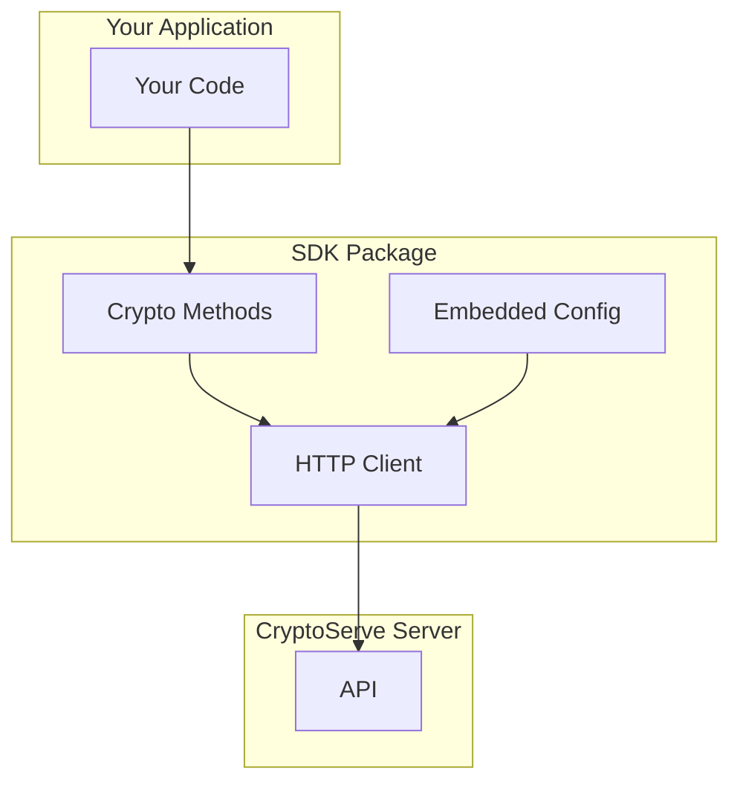

# SDK Reference

CryptoServe provides client SDKs with embedded identity for zero-configuration encryption.

## Available SDKs

| SDK | Description | Link |
|-----|-------------|------|
| **Python SDK** | Full-featured SDK for Python 3.9+ — available on [PyPI](https://pypi.org/project/cryptoserve/) | [Python SDK](python.md) |
| **TypeScript SDK** *(Coming Soon)* | Type-safe SDK for Node.js and browsers — in development | [TypeScript SDK](typescript.md) |
| **Examples** | Code examples for common use cases | [Examples](examples.md) |
| **CLI Reference** | All CLI commands — scanning, offline crypto, certificates, server management | [CLI Reference](../cli.md) |

## SDK Architecture



## Key Features

### Zero Configuration

Auto-registration with a one-time login:

```python
from cryptoserve import CryptoServe

# One-time: cryptoserve login
crypto = CryptoServe(app_name="my-app", team="platform")

# Encrypt with zero config!
encrypted = crypto.encrypt_string("secret", context="user-pii")
```

### Automatic Token Management

The SDK handles:

- Token refresh before expiration
- Retry on transient failures
- Connection pooling

### Type Safety

Full type hints for IDE support:

```python
from cryptoserve import CryptoServe
from cryptoserve.types import EncryptResult

crypto = CryptoServe(app_name="my-app", team="platform")

result: EncryptResult = crypto.encrypt_string("data", context="pii")
# IDE knows: result.ciphertext, result.algorithm, result.key_id
```

## How It Works

### 1. Identity Embedding

When you download an SDK, your identity configuration is embedded:

```python
# Inside the SDK package
_CONFIG = {
    "identity_id": "id_abc123",
    "server_url": "https://your-server",
    "public_key": "...",
    "private_key_encrypted": "...",
}
```

### 2. Token Generation

The SDK generates JWTs signed with your Ed25519 private key:

```python
# Automatic - you don't need to do this
token = jwt.encode(
    {"sub": identity_id, "exp": now + 3600},
    private_key,
    algorithm="EdDSA"
)
```

### 3. API Calls

The SDK makes authenticated API calls:

```python
# Also automatic
response = requests.post(
    f"{server_url}/v1/crypto/encrypt",
    headers={"Authorization": f"Bearer {token}"},
    json={"plaintext": base64_data, "context": context}
)
```

## Installation

Install from PyPI:

```bash
pip install cryptoserve
```

Or download a pre-configured SDK from the dashboard:

```bash
# From the dashboard, copy your install command
pip install <your-dashboard-url>/sdk/download/YOUR_TOKEN/python
```

## SDK vs Direct API

| Feature | SDK | Direct API |
|---------|-----|------------|
| Configuration | Zero | Manual JWT setup |
| Token management | Automatic | Manual refresh |
| Type safety | Full | None |
| Offline mode | Yes (`CryptoServe.local()`) | No |
| Bundle size | ~50KB | N/A |

## Security

### Private Key Storage

The SDK's private key is encrypted at rest:

```python
# Decrypted only when needed for signing
private_key = decrypt_key(
    encrypted_key,
    derive_key_from_env()  # Uses machine-specific entropy
)
```

### Token Lifecycle

- Access tokens: 1 hour lifetime
- Automatic refresh at 50% lifetime
- Refresh tokens: 30 days (stored securely)

### Network Security

- All traffic over TLS 1.2+
- Certificate pinning (optional)
- Request signing for integrity

## Troubleshooting

**SDK installation fails**

Ensure the download URL hasn't expired. Get a new download URL from the dashboard.

**Authentication errors**

The identity may have been revoked. Check identity status in dashboard.

**Context not authorized**

Your identity may not have access to this context:

```python
# Check allowed contexts
print(crypto.get_identity_info()["contexts"])
```

**Connection timeouts**

Configure timeout and retry:

```python
crypto.configure(
    timeout=30,
    max_retries=3
)
```
